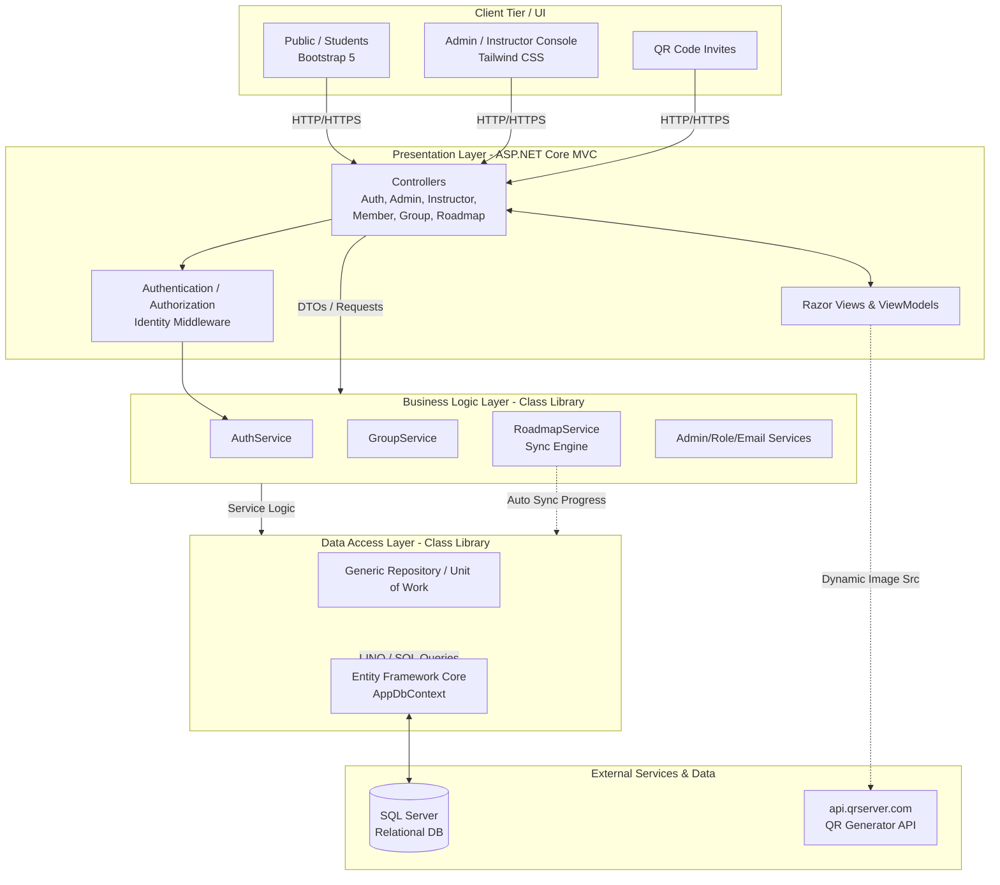
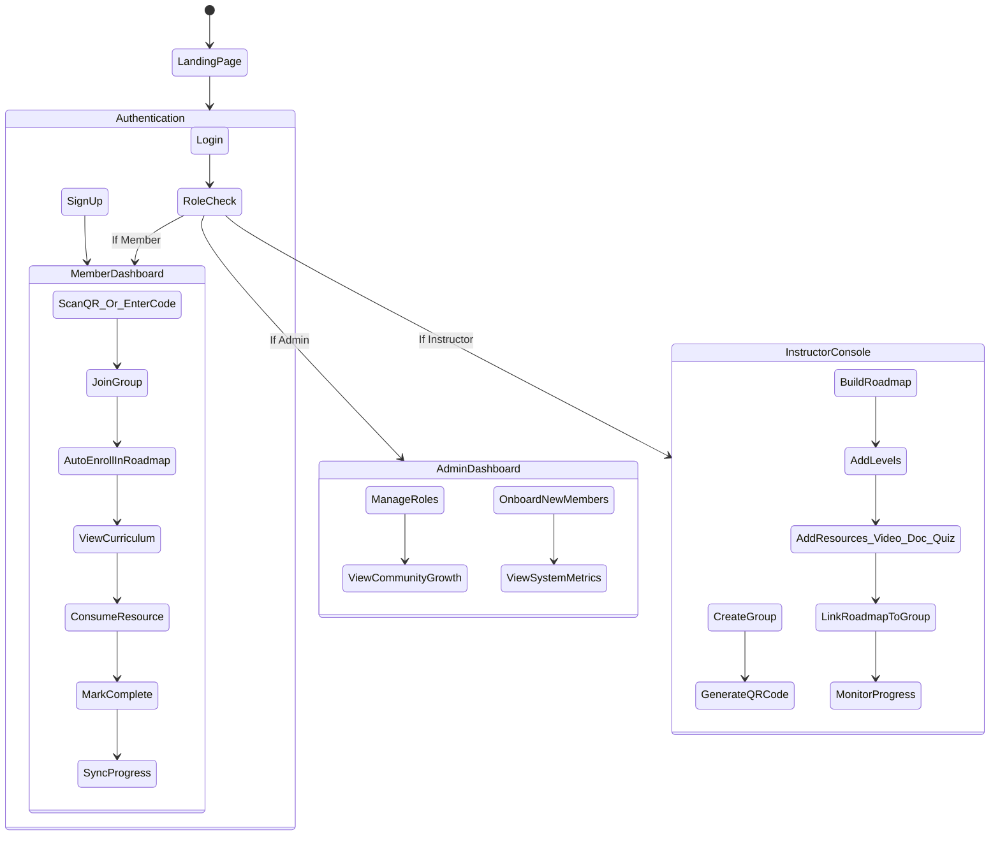

# GDG Community Dashboard - Software Design Package

## 1. System Architecture

The **GDG Community Dashboard** employs a robust **3-Tier Monolithic Architecture** designed for scalability, modularity, and explicit separation of concerns. This ensures long-term maintainability while servicing various user personas including Admins, Instructors, and Members.

### Architecture Diagram

### Component Details
* **Frontend (UI Layer):** Server-rendered HTML utilizing ASP.NET Core Razor Views. Implements dual-theme strategies: Bootstrap 5 for public endpoints and high-end Tailwind CSS for management consoles.
* **Backend Services:** C# .NET 10 handling core application operations, request validation, and identity management.
* **Database:** Relational schema managed by SQL Server and Entity Framework Core, ensuring strict normalization and declarative data integrity.
* **External Integrations:** Generates on-the-fly QR codes via `api.qrserver.com` for rapid group enrollment.

---

## 2. Application Flow

The application dictates distinct journeys depending on the user's provisioned role. Below outlines the primary application workflows seamlessly handling authentication, curriculum building, and student onboarding.

### Application Flow Diagram

---

## 3. Software Requirements Specification (SRS)

### 3.1 Introduction

**Purpose**
The purpose of this SRS is to establish a comprehensive technical blueprint for the GDG Community Dashboard. It delineates the functional and non-functional requirements to build a scalable community management and roadmapping engine.

**Scope**
The software is a web-based portal enabling Admins to monitor community health, Instructors to orchestrate study cohorts and construct learning paths, and Members to consume educational content while their progress is tracked seamlessly.

**Definitions**
* **GDG:** Google Developer Groups.
* **Roadmap:** A structured path of educational milestones.
* **Level:** A single module or epoch within a Roadmap.
* **RBAC:** Role-Based Access Control.

### 3.2 Overall Description

**Product Perspective**
The system serves as an independent, standalone ecosystem designed to supersede fragmented tools (like spreadsheets and generic LMS platforms) traditionally used by GDG chapters for group management. It is a monolithic MVC web app structured in 3 distinct tiers.

**User Personas**
1. **Admin:** System owners responsible for overriding roles, managing core configurations, and observing meta-level analytics.
2. **Instructor:** Curriculum builders and cohort mentors who oversee directly managed groups.
3. **Member:** The primary learner who consumes curricula and fulfills tasks.
4. **Guest:** Unauthenticated users viewing public-facing promotional pages.

### 3.3 Functional Requirements

**Authentication & Registration**
* **FR-1.1:** The system shall allow users to register an account using Email and Password.
* **FR-1.2:** The system shall implement RBAC, isolating UI elements and controller endpoints using `[Authorize(Roles="RoleName")]`.
* **FR-1.3:** The system shall support seeded default Admin and Instructor accounts upon initial startup.

**Classroom & Group Management**
* **FR-2.1:** Instructors shall be able to create, edit, and delete `CommunityGroup` entities.
* **FR-2.2:** The system shall automatically generate a unique 6-character alphanumeric `JoinCode` for every new group.
* **FR-2.3:** The system shall generate a sharable URL and a scannable QR code referencing the unique `JoinCode`.
* **FR-2.4:** Members shall be able to join an active group by providing its code.

**Curriculum & Roadmap Builder**
* **FR-3.1:** Instructors shall be able to create `Roadmaps` categorized by topic and difficulty.
* **FR-3.2:** Instructors shall be capable of nesting multiple `RoadmapLevels` within a Roadmap.
* **FR-3.3:** Instructors shall attach generic `Resource` models (VideoCourse, Article, PracticalTask, Quiz) to Levels.

**Smart Progress Syncing**
* **FR-4.1:** Upon a Member joining a group, the system shall instantiate progress trackers (`UserNodeProgress`) for all existing Roadmap nodes at 0%.
* **FR-4.2:** If an Instructor appends new content to a Roadmap, the system shall dynamically query and provision the new tracker node for all historically enrolled Members without requiring manual migration.

### 3.4 Non-Functional Requirements

* **Performance:** 95% of server responses for non-computation-heavy page loads should be under 200ms.
* **Scalability:** The three-tier architecture shall permit the BLL and DAL to be abstracted into microservices or separate Web APIs in future iterations if necessary.
* **Security:** Passwords shall be cryptographically hashed using ASP.NET Core Identity's default secure hash algorithms. Prevent IDOR (Insecure Direct Object Reference) by ensuring Users only query progress linked to their own claims.
* **Availability:** The system should maintain a 99.9% uptime suitable for global multi-region deployments.
* **Usability:** The administrative UI shall utilize the "Bento Grid" paradigm, emphasizing visual hierarchy and actionable metrics.

### 3.5 System Architecture Description

The software opts for the **ASP.NET Core 10 MVC 3-Tier** pattern.
* **UI (GDG DashBoard):** Uses Razor and modern CSS frameworks (Tailwind/Bootstrap). It intercepts HTTP requests and formulates ViewModels.
* **BLL (GDG DashBoard.BLL):** Abstracts core business logic into domain services. Prevents heavy logic from polluting the Controllers.
* **DAL (GDG DashBoard.DAL):** Manages the `AppDbContext`, EF Core Migrations, and implements the `IGenericRepositoryAsync` Generic Repository pattern. Provides strong typed entity interactions shielding the Database topology from the BLL.

### 3.6 Data Design

The database represents a highly normalized relational schema.
**Key Entities and Relationships:**
* `ApplicationUser (1)` -> `(M) UserRole`
* `CommunityGroup (1)` -> `(M) GroupMember`
* `Roadmap (1)` -> `(M) RoadmapLevel`
* `RoadmapLevel (1)` -> `(M) Resource`
* `ApplicationUser (1)` -> `(M) UserNodeProgress`
* `Resource (1)` -> `(M) UserNodeProgress`

**Core Relationships Structure:** 
A `Group` represents a cohort of students undergoing a single `Roadmap`. `UserNodeProgress` serves as a cross-reference entity tracking the completion Boolean and metadata of a specific Learner traversing a specific `Resource`. Profile information is broken out into 1-to-many lookup tables (`Education`, `Experience`, `UserSkill`).

### 3.7 API Design

Since this is an MVC Application, most data is formulated into Views. However, external integrations include:
* **QR Generation Endpoint:**
  * **URL:** `https://api.qrserver.com/v1/create-qr-code/?size=150x150&data={JoinCodeURL}`
  * **Method:** GET
  * **Response:** PNG image stream of the QR Code.

### 3.8 Constraints

* **Technical Constraints:** Relies strictly on a Windows/Linux environment capable of hosting .NET 10 SDK runtimes and SQL Server.
* **Business Constraints:** Requires manual instructor intervention to verify "PracticalTasks" if not fully automated through external CI/CD pipelines.

### 3.9 Future Enhancements

* **Gamification:** Implementation of XP, badges, and leaderboards mapping to the `UserNodeProgress` engine.
* **Microservices Pivot:** Should traffic exponentially increase, separating the monolithic MVC app by hoisting the BLL into a discrete REST or gRPC API.
* **Native Authentication:** Support for Google OAuth and GitHub login integration.
